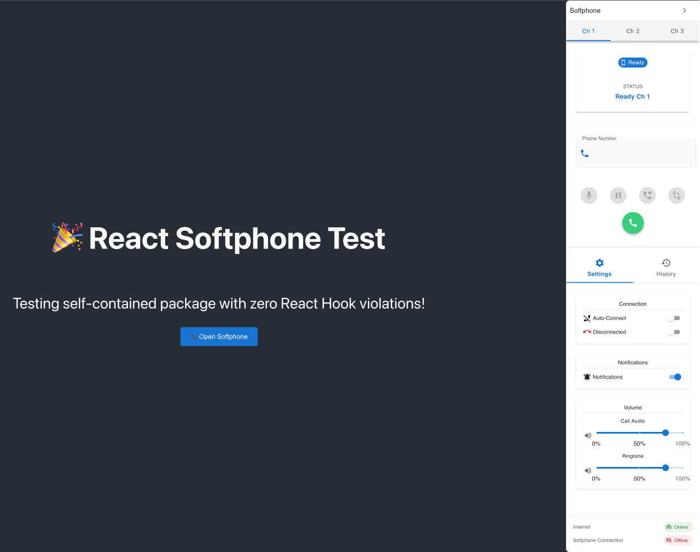

# React SoftPhone

[](https://www.npmjs.com/package/react-softphone)

A modern WebRTC softphone component for React applications with all dependencies bundled and zero translation dependencies.

## 📱 Interface Preview



*Modern, clean interface with call controls, settings, and multi-channel support*

## ✨ Features

- 🚀 **Self-Contained** - All MUI dependencies bundled, no additional installs needed
- 📦 **Simple Installation** - Just `npm install react-softphone` and you're ready
- 🎯 **Material Design** - Beautiful UI with Material-UI components included
- 📱 **WebRTC Ready** - Built on JsSIP for reliable VoIP calls
- ⚛️ **Modern React** - Uses hooks and modern React patterns
- 🎨 **Built-in Launcher** - Optional floating launcher button
- 📞 **Call Management** - Hold, transfer, conference, and attended transfer support

## 📦 Installation

```bash
npm install react-softphone
```

**That's it!** All MUI dependencies are bundled - no additional packages needed.


## 🚀 Step-by-Step Setup Guide

Follow this complete tutorial to get React Softphone working in your app:

### Step 1: Create a New React App

```bash
# Create a new React application
npx create-react-app my-softphone-app
cd my-softphone-app
```

### Step 2: Install React Softphone

```bash
# Install the react-softphone package
npm install react-softphone
```

### Step 3: Add Audio Files

Create the required audio files in your `public` directory:

```bash
# Create sound directory
mkdir public/sound

# Add your audio files (you'll need to provide these)
# public/sound/ringing.ogg - Incoming call ringtone
# public/sound/ringback.ogg - Outgoing call ringback tone
```

### Step 4: Replace App.js Content

Replace the contents of `src/App.js` with:

```jsx
import React, { useState } from 'react';
import SoftPhone from 'react-softphone';
import './App.css';

function App() {
  // State to control softphone visibility
  const [softPhoneOpen, setSoftPhoneOpen] = useState(false);
  
  // Your SIP server configuration
  const sipConfig = {
    domain: 'your-sip-server.com',        // Your SIP domain
    uri: 'sip:your-extension@your-sip-server.com',  // Your SIP URI
    password: 'your-sip-password',        // Your SIP password
    ws_servers: 'wss://your-sip-server.com:8089/ws', // WebSocket server
    display_name: 'Your Name',            // Display name for calls
    debug: false,                         // Set to true for debugging
    session_timers_refresh_method: 'invite'
  };

  // Settings state with localStorage persistence
  const [callVolume, setCallVolume] = useState(() => {
    const saved = localStorage.getItem('softphone-call-volume');
    return saved ? parseFloat(saved) : 0.8;
  });
  
  const [ringVolume, setRingVolume] = useState(() => {
    const saved = localStorage.getItem('softphone-ring-volume');
    return saved ? parseFloat(saved) : 0.6;
  });
  
  const [notifications, setNotifications] = useState(() => {
    const saved = localStorage.getItem('softphone-notifications');
    return saved ? JSON.parse(saved) : true;
  });
  
  const [connectOnStart, setConnectOnStart] = useState(() => {
    const saved = localStorage.getItem('softphone-connect-on-start');
    return saved ? JSON.parse(saved) : false;
  });

  // Functions to save settings (implement localStorage if needed)
  const saveConnectOnStart = (value) => {
    setConnectOnStart(value);
    localStorage.setItem('softphone-connect-on-start', value);
  };

  const saveNotifications = (value) => {
    setNotifications(value);
    localStorage.setItem('softphone-notifications', value);
  };

  const saveCallVolume = (value) => {
    setCallVolume(value);
    localStorage.setItem('softphone-call-volume', value);
  };

  const saveRingVolume = (value) => {
    setRingVolume(value);
    localStorage.setItem('softphone-ring-volume', value);
  };

  return (
    <div className="App">
      <header className="App-header">
        <h1>📞 My Softphone App</h1>
        <p>Click the button below to open the softphone</p>
        
        <button 
          onClick={() => setSoftPhoneOpen(true)}
          style={{
            padding: '12px 24px',
            fontSize: '16px',
            backgroundColor: '#1976d2',
            color: 'white',
            border: 'none',
            borderRadius: '4px',
            cursor: 'pointer',
            marginBottom: '20px'
          }}
        >
          📞 Open Softphone
        </button>

        <SoftPhone
          // Visibility control
          softPhoneOpen={softPhoneOpen}
          setSoftPhoneOpen={setSoftPhoneOpen}
          
          // Audio settings
          callVolume={callVolume}
          ringVolume={ringVolume}
          
          // Connection settings
          connectOnStart={connectOnStart}
          notifications={notifications}
          
          // SIP configuration
          config={sipConfig}
          
          // Settings callbacks
          setConnectOnStartToLocalStorage={saveConnectOnStart}
          setNotifications={saveNotifications}
          setCallVolume={saveCallVolume}
          setRingVolume={saveRingVolume}
          
          // Optional: Built-in floating launcher
          builtInLauncher={true}
          launcherPosition="bottom-right"
          launcherSize="medium"
          launcherColor="primary"
          
          // Optional: Accounts for call transfer
          asteriskAccounts={[]}
          
          // Optional: Timezone for call history
          timelocale="UTC"
        />
      </header>
    </div>
  );
}

export default App;
```

### Step 5: Update App.css (Optional Styling)

Add these styles to `src/App.css`:

```css
.App {
  text-align: center;
}

.App-header {
  background-color: #282c34;
  padding: 20px;
  color: white;
  min-height: 100vh;
  display: flex;
  flex-direction: column;
  align-items: center;
  justify-content: center;
}

.App-header h1 {
  margin-bottom: 10px;
}

.App-header p {
  margin-bottom: 30px;
  opacity: 0.8;
}
```

### Step 6: Configure Your SIP Settings

Update the `sipConfig` object in Step 4 with your actual SIP server details:

```javascript
const sipConfig = {
  domain: 'sip.yourprovider.com',           // Replace with your SIP domain
  uri: 'sip:1001@sip.yourprovider.com',     // Replace with your extension
  password: 'your-actual-password',          // Replace with your SIP password
  ws_servers: 'wss://sip.yourprovider.com:8089/ws', // Replace with your WebSocket URL
  display_name: 'John Doe',                  // Replace with your name
  debug: false                               // Set to true for troubleshooting
};
```

### Step 7: Run Your Application

```bash
# Start the development server
npm start
```

Your app will open at `http://localhost:3000` with a working softphone!

### Step 8: Enable Debug Mode (Optional)

For troubleshooting, add this to your browser console:

```javascript
window.__SOFTPHONE_DEBUG__ = true;
```

## 📋 Requirements

### No Additional Dependencies Required

All dependencies are bundled with the package.

## 🔧 Props Configuration

### Required Props

| Property | Type | Description |
|----------|------|-------------|
| `config` | Object | SIP configuration object (see below) |
| `setConnectOnStartToLocalStorage` | Function | Callback to save auto-connect preference |
| `setNotifications` | Function | Callback to save notification preference |
| `setCallVolume` | Function | Callback to save call volume |
| `setRingVolume` | Function | Callback to save ring volume |

### Optional Props

| Property | Type | Default | Description |
|----------|------|---------|-------------|
| `softPhoneOpen` | Boolean | `false` | Controls softphone visibility |
| `setSoftPhoneOpen` | Function | `() => {}` | Callback when softphone opens/closes |
| `callVolume` | Number | `0.5` | Call audio volume (0-1) |
| `ringVolume` | Number | `0.5` | Ring audio volume (0-1) |
| `connectOnStart` | Boolean | `false` | Auto-connect on component mount |
| `notifications` | Boolean | `true` | Show browser notifications for calls |
| `timelocale` | String | `'UTC'` | Timezone for call history |
| `asteriskAccounts` | Array | `[]` | List of available accounts for transfer |
| `builtInLauncher` | Boolean | `false` | Show floating launcher button |
| `launcherPosition` | String | `'bottom-right'` | Launcher position (`'bottom-right'`, `'bottom-left'`, etc.) |
| `launcherSize` | String | `'medium'` | Launcher size (`'small'`, `'medium'`, `'large'`) |
| `launcherColor` | String | `'primary'` | Launcher color theme |

### Config Object

The `config` prop must include these SIP settings:

```javascript
const domain = 'your-sip-server.com';
const extension = 'your-extension';

const config = {
  domain: domain,
  uri: `sip:${extension}@${domain}`,
  password: 'your-password',
  ws_servers: `wss://${domain}:8089/ws`,
  display_name: extension,
  debug: false,
  session_timers_refresh_method: 'invite'
};
```

## 🎵 Audio Files

Place these audio files in your `public/sound/` directory:
- `ringing.ogg` - Incoming call ringtone
- `ringback.ogg` - Outgoing call ringback tone

## 🎨 Built-in Launcher

The softphone includes an optional floating launcher button:

```jsx
<SoftPhone
  config={config}
  builtInLauncher={true}
  launcherPosition="bottom-right"
  launcherSize="medium"
  launcherColor="primary"
  // ... other props
/>
```

Available positions: `bottom-right`, `bottom-left`, `top-right`, `top-left`
Available sizes: `small`, `medium`, `large`
Available colors: `primary`, `secondary`, `success`, `error`, `warning`, `info`

## 📞 Call Features

- **Make Calls** - Dial numbers and make outgoing calls
- **Answer/Reject** - Handle incoming calls with notifications
- **Hold/Resume** - Put calls on hold and resume them
- **Transfer** - Transfer calls to other numbers
- **Attended Transfer** - Talk to transfer target before completing
- **Conference** - Merge multiple calls into conference
- **Mute/Unmute** - Control microphone during calls
- **Call History** - View recent call history with timestamps
- **Volume Control** - Separate controls for call and ring volume

## 🌐 Browser Support

- Chrome 60+
- Firefox 55+
- Safari 11+ (with WebRTC support)
- Edge 79+

## 🐛 Debug Mode

To enable debug logging for troubleshooting:

```javascript
// Enable debug mode in your app
window.__SOFTPHONE_DEBUG__ = true;

// Now all debug messages will appear in browser console
```

This will show detailed logs for:
- Connection attempts
- Call state changes
- Notification handling
- Error messages

## 🔧 Development

```bash
# Clone the repository
git clone https://github.com/chamuridis/react-softphone.git

# Install dependencies
npm install

# Build the package
npm run build

# Create package
npm pack

# Install the created package in your project
npm install ../react-softphone/react-softphone-*.tgz  

```

## 📄 License

ISC © [chamuridis](https://github.com/chamuridis)
